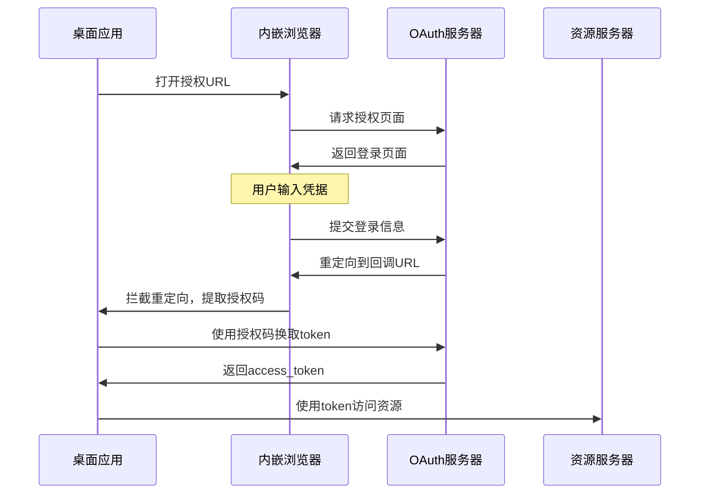

# craw

```mermaid
sequenceDiagram
    participant App as 桌面应用
    participant WebView as 内嵌浏览器
    participant OAuth as OAuth服务器
    participant API as 资源服务器

    App->>WebView: 打开授权URL
    WebView->>OAuth: 请求授权页面
    OAuth->>WebView: 返回登录页面
    Note over WebView: 用户输入凭据
    WebView->>OAuth: 提交登录信息
    OAuth->>WebView: 重定向到回调URL
    WebView->>App: 拦截重定向，提取授权码
    App->>OAuth: 使用授权码换取token
    OAuth->>App: 返回access_token
    App->>API: 使用token访问资源
```
