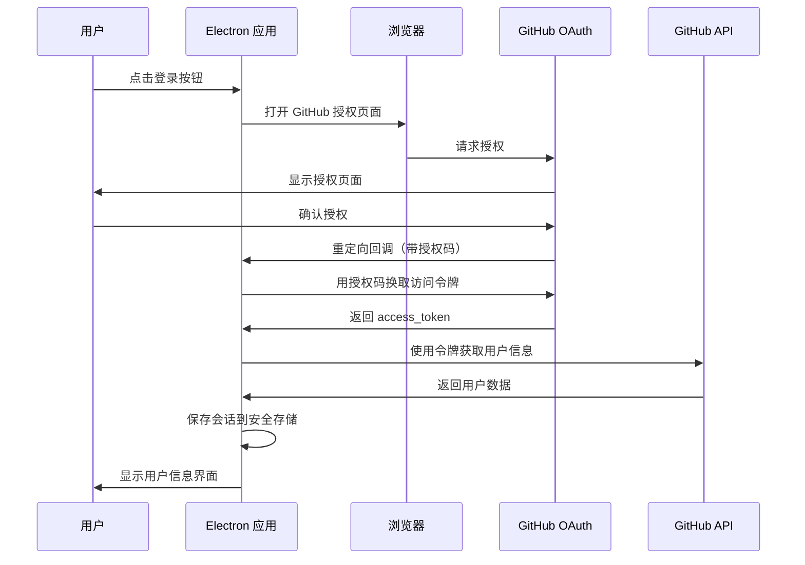
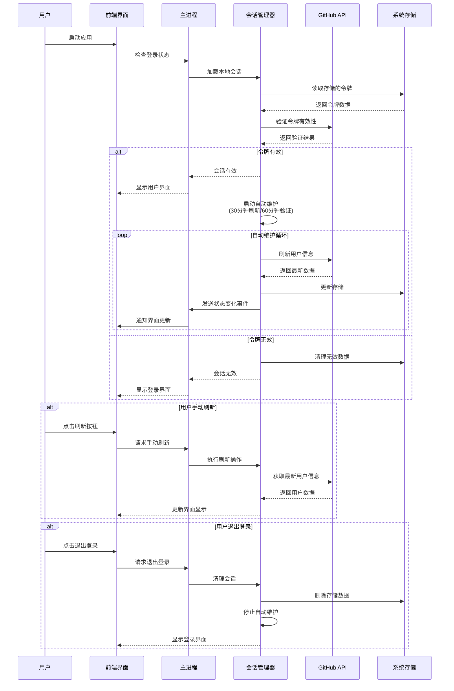

# GitHub OAuth Electron App

一个基于 Electron 的 GitHub OAuth 认证应用，提供简洁优雅的用户登录体验和完整的会话管理功能。

## ✨ 功能特性

- 🔐 **GitHub OAuth 登录** - 支持完整的 OAuth 2.0 认证流程
- 💾 **会话持久化** - 使用系统安全存储保存访问令牌
- 🔄 **自动令牌刷新** - 智能维护登录状态，无需重复登录
- ⚡ **自动恢复** - 应用重启后自动恢复登录状态
- 👤 **用户信息展示** - 显示头像、用户名、仓库统计等
- 🎨 **现代化 UI** - 简洁优雅的界面设计
- 🔒 **安全存储** - 令牌安全存储在系统钥匙串中

## 🚀 快速开始

### 1. 克隆项目

```bash
git clone <repository-url>
cd craw
```

### 2. 安装依赖

```bash
npm install
```

### 3. 配置 GitHub OAuth App

#### 3.1 创建 GitHub OAuth App

1. 访问 [GitHub OAuth Apps](https://github.com/settings/applications/new)
2. 填写应用信息：
   - **Application name**: `GitHub OAuth Electron App`（或你喜欢的名称）
   - **Homepage URL**: `http://localhost:3000`
   - **Authorization callback URL**: `http://localhost:3000/auth/callback`
3. 点击 "Register application"
4. 记下 `Client ID` 和 `Client Secret`

#### 3.2 配置环境变量

在项目根目录创建 `.env` 文件：

```bash
# GitHub OAuth 配置
GITHUB_CLIENT_ID=你的_client_id
GITHUB_CLIENT_SECRET=你的_client_secret

# OAuth 回调地址（需要与 GitHub OAuth App 中配置的一致）
OAUTH_REDIRECT_URI=http://localhost:3000/auth/callback

# 应用配置
NODE_ENV=development
LOG_LEVEL=debug
```

### 4. 构建并运行

```bash
# 构建项目
npm run build

# 启动应用
npm start
```

## 📱 使用流程

### OAuth 登录流程



### 自动令牌刷新流程



### 详细步骤

#### 1. 启动应用
- 应用启动时自动检查是否有已保存的登录会话
- 如果有有效会话，直接显示用户信息
- 如果没有或会话过期，显示登录界面

#### 2. 用户登录
1. **点击登录按钮** - 界面上的 "使用 GitHub 登录" 按钮
2. **跳转授权页面** - 自动在默认浏览器中打开 GitHub 授权页面
3. **用户授权** - 在 GitHub 页面上点击 "Authorize" 确认授权
4. **获取授权码** - GitHub 重定向到本地回调地址，应用拦截并提取授权码
5. **换取访问令牌** - 应用使用授权码向 GitHub 换取访问令牌
6. **获取用户信息** - 使用访问令牌调用 GitHub API 获取用户详细信息
7. **保存会话** - 将令牌和用户信息安全保存到系统存储中
8. **显示用户界面** - 切换到用户信息展示页面

#### 3. 用户信息展示
登录成功后，界面会显示：
- **用户头像** - 100x100px 圆形头像
- **用户姓名** - 真实姓名或用户名
- **用户名** - @username 格式
- **统计信息**：
  - 公开仓库数量
  - 关注者数量
  - 关注的人数量

#### 4. 会话管理
- **自动恢复** - 应用重新打开时自动检查并恢复登录状态
- **自动令牌刷新** - 每30分钟自动刷新用户信息，每60分钟验证令牌有效性
- **智能重试** - 网络故障时自动重试最多3次，避免误判会话过期
- **后台维护** - 所有刷新操作在后台进行，不影响用户正常使用
- **手动刷新** - 提供手动刷新按钮，用户可随时更新信息
- **实时状态** - 界面实时显示会话状态和刷新进度
- **安全退出** - 点击退出登录按钮，清理所有存储的认证数据并停止自动维护

## 🛠️ 开发指南

### 项目结构

```
src/
├── oauth/                 # OAuth 相关功能
│   ├── OAuthManager.ts    # OAuth 授权流程管理
│   └── UserSessionManager.ts # 用户会话管理
├── api/                   # API 调用
│   └── GitHubAPI.ts       # GitHub API 封装
├── config/                # 配置管理
│   ├── env.ts            # 环境变量处理
│   └── github.ts         # GitHub 配置
├── main/                  # 主进程
│   └── main.ts           # Electron 主进程入口
├── preload/               # 预加载脚本
│   └── preload.ts        # 安全的 API 桥接
└── renderer/              # 渲染进程
    ├── index.html        # 应用界面
    └── renderer.ts       # 前端逻辑
```

### 核心 API

#### OAuth 操作
```javascript
// 登录
const result = await window.electronAPI.oauth.login();

// 登出
const result = await window.electronAPI.oauth.logout();

// 获取登录状态
const status = await window.electronAPI.oauth.getStatus();

// 刷新用户信息（兼容性 API）
const result = await window.electronAPI.oauth.refreshUser();

// 手动刷新会话
const result = await window.electronAPI.oauth.manualRefresh();

// 获取会话状态信息
const sessionStatus = await window.electronAPI.oauth.getSessionStatus();

// 获取访问令牌
const token = await window.electronAPI.oauth.getToken();
```

#### 会话状态监听
```javascript
// 监听会话状态变化
const cleanup = window.electronAPI.onSessionStatusChange((event) => {
  if (event.isLoggedIn && event.user) {
    console.log('会话已自动刷新:', event.user);
    // 更新界面显示
    updateUserInfo(event.user);
  } else {
    console.log('会话已过期，需要重新登录');
    // 跳转到登录界面
    showLoginInterface();
  }
});

// 清理监听器（组件卸载时调用）
cleanup();
```

#### 使用访问令牌调用 GitHub API
```javascript
const token = await window.electronAPI.oauth.getToken();
if (token) {
  const response = await fetch('https://api.github.com/user/repos', {
    headers: {
      'Authorization': `Bearer ${token}`,
      'Accept': 'application/vnd.github.v3+json'
    }
  });
  const repos = await response.json();
}
```

## 🔐 安全特性

### 令牌安全存储
- **系统级存储**: 使用 `keytar` 库将访问令牌存储在系统安全存储中
  - **macOS**: Keychain
  - **Windows**: Credential Store
  - **Linux**: Secret Service API
- **不存明文**: 令牌不会以明文形式存储在配置文件中
- **自动清理**: 应用卸载时自动清理存储的凭据

### 会话验证与自动维护
- **定期验证**: 每60分钟自动验证令牌有效性
- **自动刷新**: 每30分钟自动刷新用户信息和会话状态
- **智能重试**: 网络故障时最多重试3次，避免误判
- **后台运行**: 所有维护操作在后台进行，不打扰用户
- **事件通知**: 会话状态变化时自动通知前端界面
- **自动清理**: 令牌失效时自动清理会话数据
- **错误处理**: 完善的网络和认证错误处理机制

## 🎨 界面特色

### 设计理念
- **极简主义** - 专注核心功能，移除不必要的元素
- **现代化** - 采用现代 Web 设计趋势
- **响应式** - 适配不同屏幕尺寸

### 视觉特点
- **渐变背景** - 优雅的紫色渐变
- **卡片设计** - 居中的白色圆角卡片
- **动画效果** - 按钮悬停和加载动画
- **状态反馈** - 实时的操作状态提示

## 📝 配置说明

### 环境变量

| 变量名 | 必需 | 说明 | 默认值 |
|--------|------|------|--------|
| `GITHUB_CLIENT_ID` | ✅ | GitHub OAuth App 的 Client ID | - |
| `GITHUB_CLIENT_SECRET` | ✅ | GitHub OAuth App 的 Client Secret | - |
| `OAUTH_REDIRECT_URI` | ❌ | OAuth 回调地址 | `http://localhost:3000/auth/callback` |
| `NODE_ENV` | ❌ | 运行环境 | `development` |
| `LOG_LEVEL` | ❌ | 日志级别 | `info` |

### GitHub OAuth App 设置
- **Authorization callback URL**: 必须设置为 `http://localhost:3000/auth/callback`
- **Application type**: Web application
- **Homepage URL**: 可以设置为 `http://localhost:3000`

## 🐛 故障排除

### 常见问题

#### 1. 登录失败
- **检查网络连接**
- **验证 GitHub OAuth App 配置**
- **确认回调地址设置正确**
- **检查端口 3000 是否被占用**

#### 2. 令牌存储失败
- **确保 keytar 库正确安装**
- **检查系统权限**
- **在 Linux 上确保安装了 Secret Service**

#### 3. 会话无法恢复
- **检查存储的令牌是否被手动删除**
- **验证令牌是否在 GitHub 上被撤销**
- **确认应用配置是否发生变化**

#### 4. 自动刷新失败
- **检查网络连接是否稳定**
- **确认 GitHub API 服务是否正常**
- **查看是否达到 API 限制**
- **验证令牌权限是否足够**

#### 5. 频繁显示重试消息
- **这通常是网络不稳定导致的**
- **系统会自动重试，无需手动干预**
- **如果持续出现，请检查网络设置**

### 调试模式
设置 `LOG_LEVEL=debug` 可以看到详细的调试信息：

```bash
LOG_LEVEL=debug npm start
```

## 📋 开发脚本

```bash
# 安装依赖
npm install

# 开发模式（支持热重载）
npm run dev

# 构建项目
npm run build

# 仅构建 TypeScript
npm run build:ts

# 仅构建静态文件
npm run build:static

# 启动应用
npm start

# 清理构建文件
npm run clean
```

## 🤝 贡献指南

1. Fork 项目
2. 创建功能分支 (`git checkout -b feature/AmazingFeature`)
3. 提交更改 (`git commit -m 'Add some AmazingFeature'`)
4. 推送到分支 (`git push origin feature/AmazingFeature`)
5. 开启 Pull Request

## 📄 许可证

本项目采用 MIT 许可证 - 查看 [LICENSE](LICENSE) 文件了解详情。

## 📚 详细文档

- [自动令牌刷新功能说明](docs/Auto_Token_Refresh.md) - 详细的自动令牌刷新机制说明
- [加载状态修复说明](docs/Loading_State_Fix.md) - 启动界面优化说明

## 🙏 致谢

- [Electron](https://www.electronjs.org/) - 跨平台桌面应用框架
- [GitHub API](https://docs.github.com/en/rest) - GitHub REST API
- [keytar](https://github.com/atom/node-keytar) - 系统凭据安全存储
