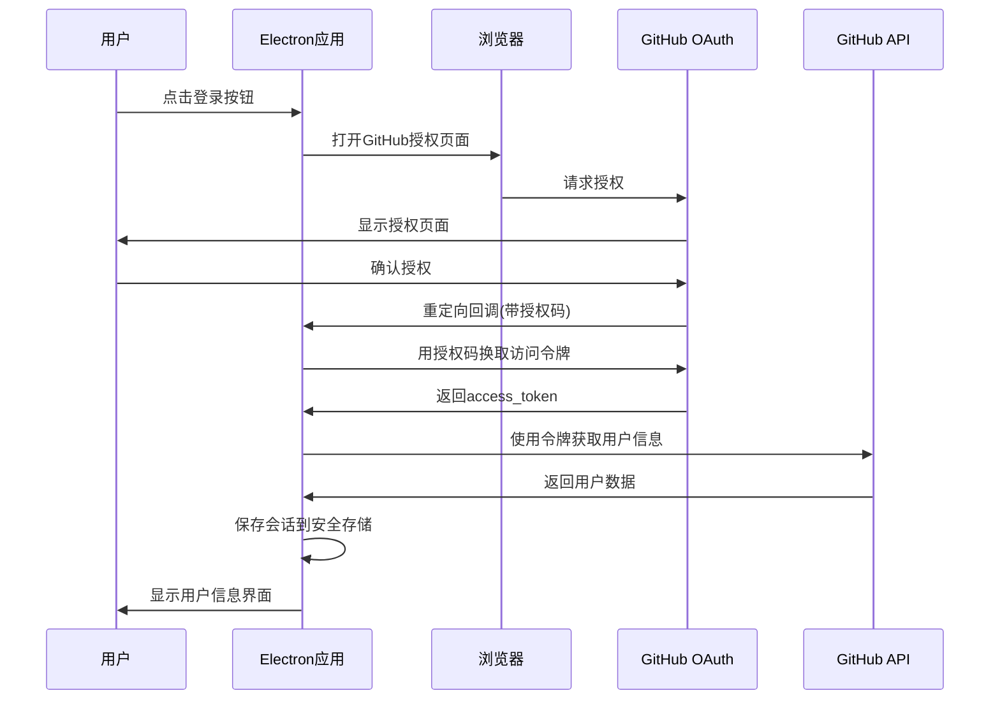
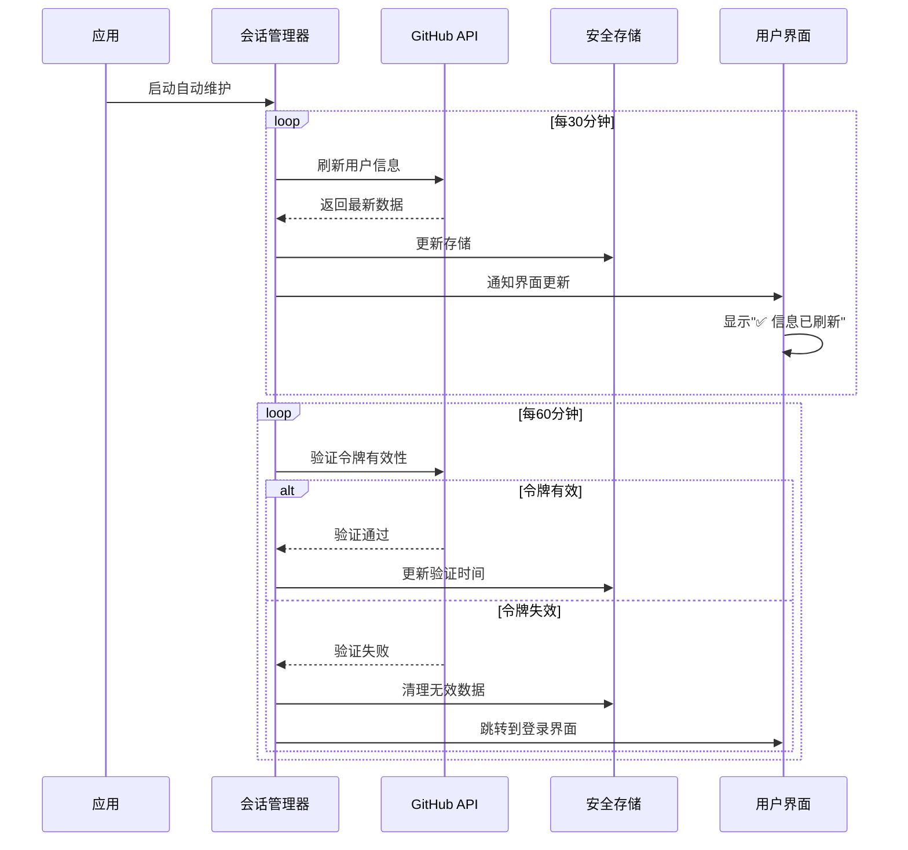

# GitHub OAuth Electron App

一个基于 Electron 的 GitHub OAuth 认证应用，提供简洁优雅的用户登录体验和完整的会话管理功能。

## ✨ 功能特性

- 🔐 **GitHub OAuth 登录** - 支持完整的 OAuth 2.0 认证流程
- 💾 **会话持久化** - 使用本地加密文件保存访问令牌
- 🔄 **自动令牌维护** - 智能维护登录状态，无需重复登录
  - 🕐 每30分钟自动刷新用户信息
  - 🕑 每60分钟验证令牌有效性
- ⚡ **自动恢复** - 应用重启后自动恢复登录状态
- 🔒 **安全存储** - 令牌加密存储在用户数据目录，无需密码访问

## 🚀 快速开始

### 1. 克隆项目

```bash
git clone <repository-url>
cd craw
```

### 2. 安装依赖

```bash
npm install
```

### 3. 配置 GitHub OAuth App

#### 3.1 创建 GitHub OAuth App

1. 访问 [GitHub OAuth Apps](https://github.com/settings/applications/new)
2. 填写应用信息：
   - **Application name**: `GitHub OAuth Electron App`（或你喜欢的名称）
   - **Homepage URL**: `http://localhost:3000`
   - **Authorization callback URL**: `http://localhost:3000/auth/callback`
3. 点击 "Register application"
4. 记下 `Client ID` 和 `Client Secret`

#### 3.2 配置环境变量

在项目根目录创建 `.env` 文件：

```bash
# GitHub OAuth 配置
GITHUB_CLIENT_ID=你的_client_id
GITHUB_CLIENT_SECRET=你的_client_secret

# OAuth 回调地址（需要与 GitHub OAuth App 中配置的一致）
OAUTH_REDIRECT_URI=http://localhost:3000/auth/callback

# 应用配置
NODE_ENV=development
LOG_LEVEL=debug
```

### 4. 构建并运行

```bash
# 完整构建（包含清理）
npm run build

# 启动应用
npm start
```

## 📱 使用流程

### OAuth 登录流程



### 自动会话维护流程



### 详细步骤

### 1. 启动应用
- 应用启动时自动检查是否有已保存的登录会话
- 如果有有效会话，直接显示用户信息和"欢迎回来！"消息
- 如果没有或会话过期，显示登录界面

### 2. 用户登录
1. **点击登录按钮** - 界面上的 "使用 GitHub 登录" 按钮
2. **跳转授权页面** - 自动在默认浏览器中打开 GitHub 授权页面
3. **用户授权** - 在 GitHub 页面上点击 "Authorize" 确认授权
4. **自动处理** - 应用自动获取授权码、换取令牌、保存会话
5. **显示用户界面** - 成功后显示用户信息和自动维护状态

### 3. 用户信息展示
登录成功后，界面会显示：
- **用户头像** - 60x60px 圆形头像
- **用户姓名** - 真实姓名或用户名
- **用户名** - @username 格式
- **邮箱** - 主要邮箱地址
- **仓库统计** - 公开仓库数量

### 4. 会话管理
- **自动维护** - 后台自动刷新令牌和用户信息
- **手动刷新** - 点击"刷新信息"按钮立即更新
- **实时通知** - 成功刷新时显示"✅ 信息已刷新"消息
- **安全退出** - 点击"退出登录"清理所有数据

## 🛠️ 开发指南

### 项目结构

```
src/
├── main/                  # 主进程
│   └── main.ts           # 应用入口和IPC处理
├── preload/               # 预加载脚本
│   └── preload.ts        # 安全的API桥接
├── renderer/              # 渲染进程
│   ├── index.html        # 应用界面
│   └── renderer.ts       # 前端逻辑
├── oauth/                 # OAuth 相关功能
│   ├── OAuthManager.ts   # OAuth 授权流程管理
│   └── UserSessionManager.ts # 用户会话管理（简化版）
├── api/                   # API 调用
│   └── GitHubAPI.ts      # GitHub API 封装
├── config/                # 配置管理
│   ├── env.ts            # 环境变量处理
│   └── github.ts         # GitHub OAuth 配置
└── types/                 # TypeScript 类型定义
    └── index.ts

scripts/
└── build.sh              # 构建脚本

dist/                      # 编译输出
├── main/
├── preload/
├── renderer/
├── oauth/
├── api/
├── config/
└── types/
```

### 核心组件

#### 1. UserSessionManager
- **自动令牌维护**：30分钟刷新用户信息，60分钟验证令牌
- **会话持久化**：使用本地加密文件存储令牌
- **错误处理**：简化的错误处理逻辑
- **事件通知**：支持会话状态变化回调

#### 2. 主进程 IPC 处理器
- `oauth:login` - 处理登录请求
- `oauth:logout` - 处理退出登录
- `oauth:get-status` - 获取登录状态
- `oauth:manual-refresh` - 手动刷新用户信息

#### 3. 前端界面
- **响应式设计**：适配不同窗口大小
- **状态管理**：统一的状态消息显示
- **实时更新**：监听会话状态变化
- **用户体验**：流畅的加载和切换动画

## 🔧 技术栈
- **Electron** - 跨平台桌面应用框架
- **TypeScript** - 类型安全的JavaScript
- **Node.js** - 运行时环境
- **File System** - 本地加密文件存储
- **dotenv** - 环境变量管理

## 💾 数据存储

### 存储位置
应用数据存储在用户数据目录的 `session_data` 文件夹中：
- **macOS**: `~/Library/Application Support/GitHub OAuth App/session_data/`
- **Windows**: `%APPDATA%/GitHub OAuth App/session_data/`
- **Linux**: `~/.config/GitHub OAuth App/session_data/`

### 存储内容
- `github_access_token.json` - 加密的访问令牌
- `github_user_data.json` - 加密的用户会话数据

### 安全特性
- ✅ **本地加密**：所有敏感数据使用AES-256-GCM加密
- ✅ **无需密码**：不依赖系统钥匙串，避免密码提示
- ✅ **自动清理**：退出登录时自动删除所有存储数据
- ✅ **权限保护**：文件权限设置为仅所有者可访问

### v1.0.0 - 初始版本
- ✅ 基础GitHub OAuth登录功能
- ✅ 自动会话维护机制
- ✅ 用户信息展示界面
